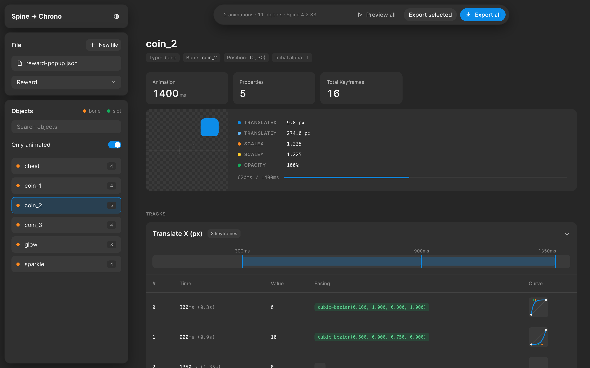
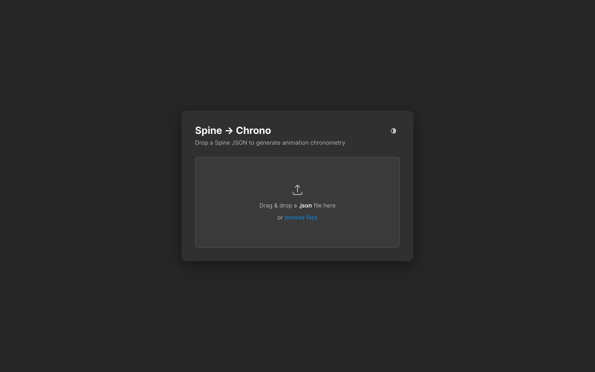
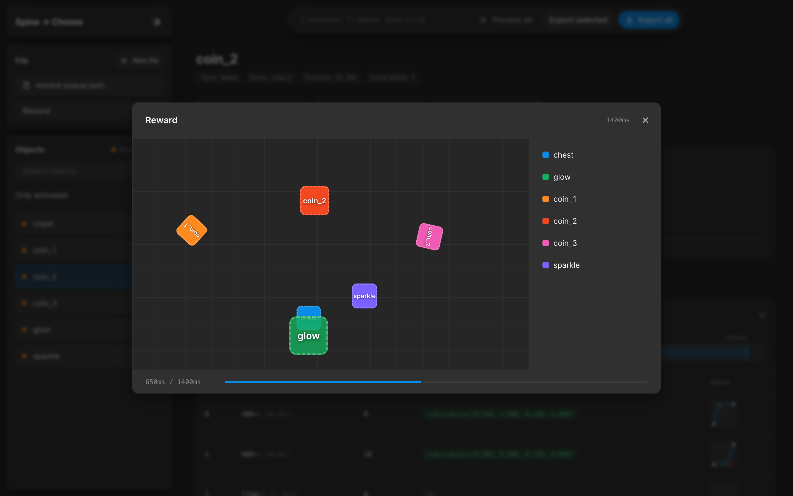
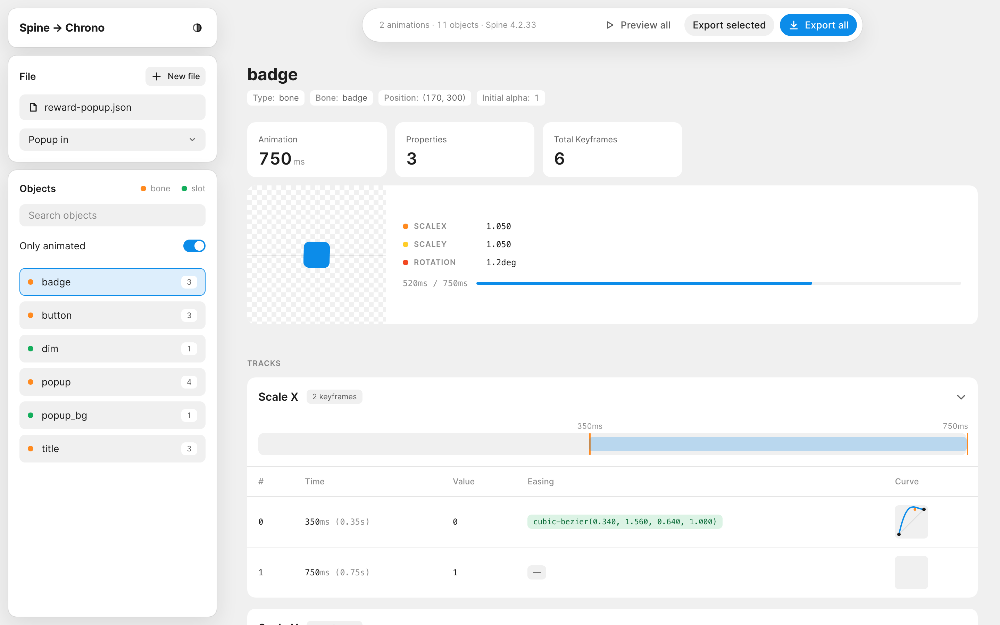

# Spine to Chrono

Turns a Spine 2D animation into a **chronometry**: every keyframe of every object with its exact time,
value and easing written as CSS `cubic-bezier()`. Hand it to developers and the motion can be rebuilt
1:1 in code (CSS, the Web Animations API, native code) instead of guessing curves from a video.



## Try it in a minute

1. Open `index.html` in a browser. No install, no server, nothing is uploaded anywhere.
2. Drop `demo/reward-popup.json` on the page: an invented reward pop-up with two animations,
   *Popup in* and *Reward*.
3. Pick an animation, click an object, press **Preview all**.



## What you see

**Objects** on the left: every bone and slot of the skeleton, with how many properties each one
animates in the chosen animation. Search by name; *Only animated* hides the rest. An orange dot is a
bone, a green one is a slot.

**An object** in the middle:

- *summary* — length of the animation, animated properties, keyframes;
- *live preview* — a stand-in box moves, scales, turns and fades exactly as the object does, with the
  current value of every property and a progress bar;
- *a track per property* — keyframes on a timeline, then a table: time in ms and seconds, value,
  easing to the next keyframe (`cubic-bezier(…)`, `linear` or `stepped`) and a small drawing of the
  curve.

**Preview all** plays the whole scene: every animated object on one stage, placed by the bones of the
skeleton. Click an object there to open it.



**Export** downloads the chronometry as JSON: the whole file, or only the selected object.

Dark and light themes switch with the half-circle button.



## What is read from Spine

| Spine timeline | In the chronometry | Value |
|---|---|---|
| bone `translate` | `translateX`, `translateY` | px, relative to the setup pose |
| bone `scale` | `scaleX`, `scaleY` | factor, 1 is the original size |
| bone `rotate` | `rotation` | degrees |
| slot `rgba` | `opacity` (and `color` when it is not white) | 0–1; r, g, b |
| slot `attachment` | `attachment` | name of the image shown from this moment |

Easing between two keyframes comes from the curve of the first one:

- no curve — `linear`;
- `"stepped"` — `stepped`: the value jumps at the next keyframe;
- a Bézier curve — `cubic-bezier(x1, y1, x2, y2)`. Spine stores its control points in absolute time
  and value; they are normalised to the segment, so the result goes straight into CSS. `y` may go
  below 0 or above 1 for an overshoot, like `cubic-bezier(0.34, 1.56, 0.64, 1)`. Translate and scale
  get separate curves for x and y when Spine has them.

Supported: Spine 4.x JSON exports.

## Output format

```jsonc
{
  "meta": {
    "source": "reward-popup.json",
    "spineVersion": "4.2.33",
    "canvasSize": { "width": 1080, "height": 1920 },
    "generatedAt": "2026-10-08T21:53:37.106Z"
  },
  "elements": {                       // every slot: its bone, image and starting state
    "badge": { "bone": "badge", "attachment": "badge_x2", "initialAlpha": 1,
               "bonePosition": { "x": 170, "y": 300 } }
  },
  "animations": {
    "Popup in": {
      "name": "Popup in", "duration": 0.75, "durationMs": 750,
      "tracks": {
        "badge": {
          "type": "bone",
          "rotation": [
            { "time": 0.35, "timeMs": 350, "value": -25,
              "easing": { "easing": "cubic-bezier", "cubicBezier": [0.34, 1.56, 0.64, 1],
                          "cssEasing": "cubic-bezier(0.340, 1.560, 0.640, 1.000)" } },
            { "time": 0.75, "timeMs": 750, "value": 0 }   // the last keyframe has no easing
          ]
        }
      }
    }
  }
}
```

## Command line

The same conversion without a browser, for a build step or a batch of files:

```bash
node spine-to-chrono.js demo/reward-popup.json
```

It writes `demo/reward-popup-chrono.json` next to the input (or to a second path, if given) and prints
the animations with their length and number of tracks. Node.js 16 or newer, no dependencies.

## Files

| | |
|---|---|
| `index.html` | the web interface: one file, open it in any modern browser |
| `spine-to-chrono.js` | the command-line converter |
| `demo/reward-popup.json` | an invented Spine file to try everything on |
| `docs/` | the screenshots above, taken from the demo file |
