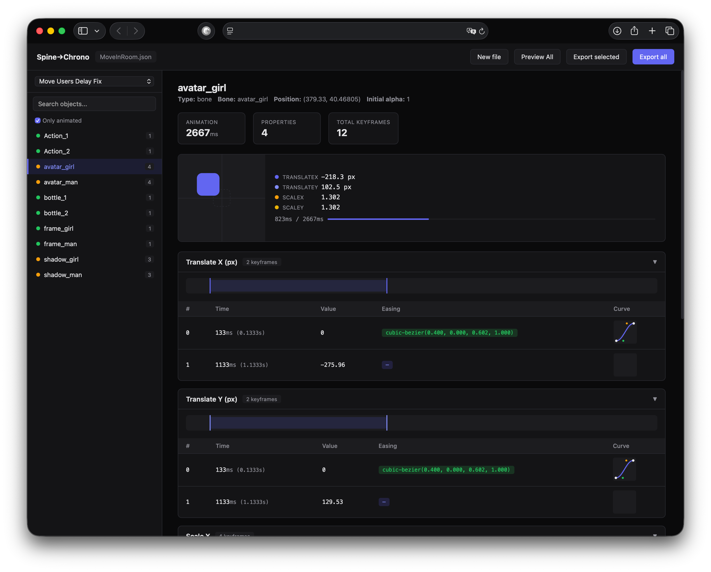

# Spine to Chrono

Converts Spine 2D animation JSON into a detailed chronometry breakdown — keyframes, easing curves, timings — ready to hand off to developers for 1:1 implementation.



## What it does

- Parses Spine JSON (translate, scale, opacity, rotation)
- Converts Spine bezier curves to CSS `cubic-bezier()` format
- Shows live animated preview per object and for the whole scene
- Exports structured JSON with all timing data

## Web UI

Open `index.html` in a browser. Drag & drop your Spine JSON file.

- Pick an animation from the dropdown
- Click any object to see its keyframes, curves, and live preview
- **Preview All** — see all objects animating together on one stage
- **Export** — download chronometry as JSON (all or selected)

## CLI

```
node spine-to-chrono.js <input.json> [output.json]
```

Outputs `<input>-chrono.json` with the same data the UI shows.
